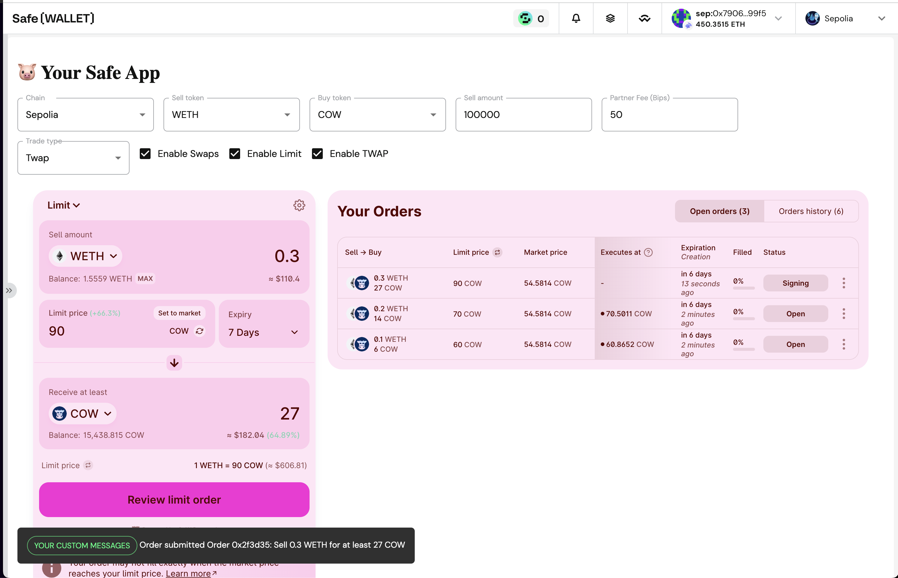

# 🐷 Your Safe App

This repository contains some boilerplate code to get you started with building a Safe App with built-in swap support.

Read the documentation on CoW Powered Safe Dapps in <https://docs.cow.fi/cow-protocol/tutorials/safe-app>

The example app embeds the CoW Swap widget in a Safe App, and allows to change some of the configuration, such as the partner fee, token lists, or theming.

It also show how to handle events happening inside CoW Swap, like the notification on a new trade.




## Getting Started

Install dependencies and start a local dev server.

```
yarn install
cp .env.sample .env
yarn start
```

## Related

- [Tutorial for CoW powered Safe Dapps](https://docs.cow.fi/cow-protocol/tutorials/safe-app)
- [Widget Landing](https://cow.fi/widget)
- [Widget Configurator](https://widget.cow.fi/)
- [Widget Docs](https://docs.cow.fi/cow-protocol/tutorials/widget)
